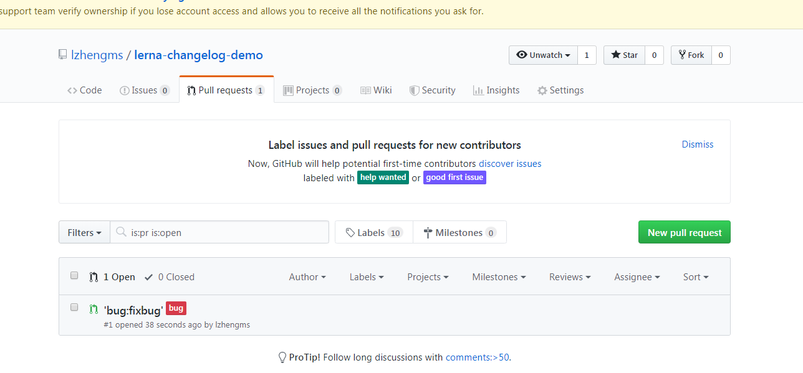

1. 本地创建一个文件夹
2. 运行 npm init -y
3. 运行 npm i lerna lerna-changelog --save-dev 
4. 运行lerna init --i
5. cd packages
6. mkdir package1 package2 package3或者使用lerna create package5
7. 分别在package1 package2, package3中运行npm init -y
8. 在 Issues那边新增一个label,名为feat

   9.从master拉取一个分支fixbug,修改完成后，并把fixbug  push到github上

  10.在github上找到fixbug，然后创建一个pr，在创建pr时，选择labels

11.提交pr后，会看到

12.在merge的时候，可以再选择labels，进行merge

